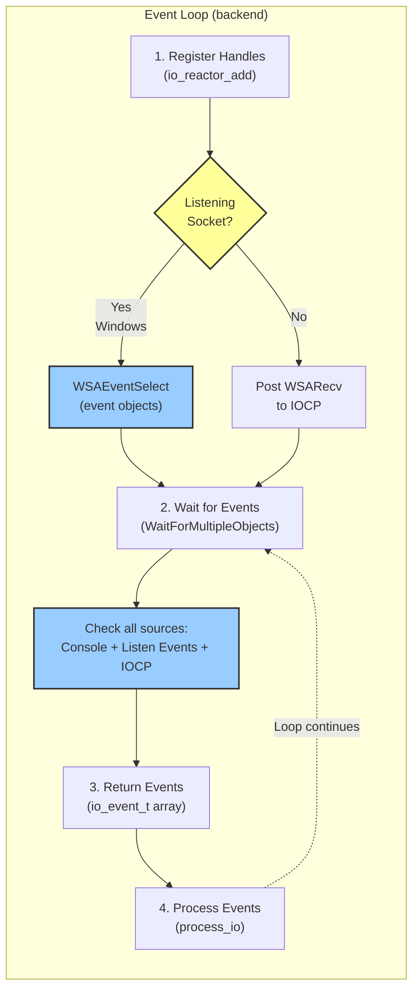
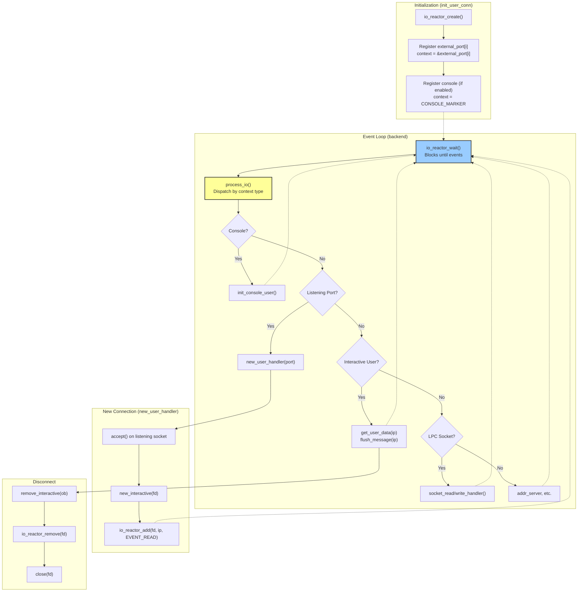

# I/O Reactor Design for Neolith Backend Loop

## Overview

This document provides comprehensive documentation for the I/O reactor design for cross-platform non-blocking I/O in Neolith. The I/O reactor is a platform-agnostic abstraction layer that provides a unified interface for non-blocking I/O multiplexing across different operating systems. It implements the **Reactor Pattern**, decoupling the event detection mechanism from event handling logic.

### Related Documents

For platform-specific implementation details, see:

1. **[Linux I/O Implementation](linux-io.md)**
   - Current `poll()` implementation
   - Migration from existing code
   - Console input handling on Linux
   - Future `epoll()` enhancement
   - Performance characteristics

2. **[Windows I/O Implementation](windows-io.md)**
   - Windows Winsock limitations
   - I/O Completion Ports (IOCP) solution
   - IOCP context structures and lifecycle
   - Console input handling on Windows
   - Performance characteristics

### Current Implementation Status

✅ **Phase 1: Core Abstraction** ([Report](../history/agent-reports/io-reactor-phase1.md))
- [x] Platform-agnostic API defined in [lib/port/io_reactor.h](../../lib/port/io_reactor.h)
- [x] POSIX `poll()` implementation in [lib/port/io_reactor_poll.c](../../lib/port/io_reactor_poll.c)
- [x] Comprehensive unit tests (19 test cases, all passing)
- [x] Build system integration

✅ **Phase 2: Windows IOCP** ([Report](../history/agent-reports/io-reactor-phase2.md))
- [x] Windows IOCP implementation in [lib/port/io_reactor_win32.c](../../lib/port/io_reactor_win32.c)
- [x] IOCP-specific unit tests (4 test cases)
- [x] Listening socket support (6 test cases) using WSAEventSelect
- [x] Console support (5 test cases) using WaitForMultipleObjects
- [x] Unified event collection from all I/O sources in single wait call
- [x] Cross-platform test suite (34 total tests, all passing)
- [x] Build system integration for Windows

✅ **Phase 3: Backend Integration** ([Design Review](../history/agent-reports/io-reactor-phase3-review.md))
- [x] Reactor initialization in `init_user_conn()` ([src/comm.c](../../src/comm.c))
- [x] Listening socket registration (`external_port[]`)
- [x] Interactive user I/O migration (`all_users[]`)
- [x] Console mode support (POSIX and Windows)
- [x] Event-driven `process_io()` with context-based dispatch
- [x] Legacy code removal (`make_selectmasks()`, `poll_index` fields)
- [x] Unit tests (34 tests passing: 19 generic + 4 IOCP + 6 listening + 5 console)
- [x] Integration verified with example mudlib

⬜ **Phase 4: LPC Socket Integration**
- [ ] Migrate `lpc_socks[]` to reactor (`PACKAGE_SOCKETS`)
- [ ] Update socket efun handlers for reactor registration
- [ ] Address server pipe integration
- [ ] Performance testing with 1000+ connections
- [ ] Stress testing (connection churn, sustained throughput)

⬜ **Phase 5: Future Enhancements**
- [ ] Linux `epoll()` backend for better scalability (O(ready) vs O(all))
- [ ] BSD/macOS `kqueue()` support
- [ ] Windows optimizations:
  - [ ] Multi-threaded IOCP worker pool
  - [ ] Zero-copy I/O (`TransmitFile`, `TransmitPackets`)
  - [ ] Pre-posted accept operations (`AcceptEx`)
- [ ] Performance benchmarking across platforms
- [ ] Connection scalability testing (10,000+ concurrent)

## Reactor Pattern Fundamentals

The reactor pattern is a design pattern for handling service requests delivered concurrently to an application by demultiplexing events and dispatching them to appropriate handlers.

### Key Components

1. **Handles**: File descriptors, sockets, or other I/O sources
2. **Event Demultiplexer**: Platform-specific mechanism (poll, epoll, IOCP, kqueue)
3. **Event Handlers**: Callbacks that process specific event types
4. **Reactor**: Orchestrates event detection and handler dispatch

### Flow



**Note**: On Windows, listening sockets use `WSAEventSelect()` with event objects (readiness-based) while connected sockets use IOCP (completion-based). All sources are unified via `WaitForMultipleObjects()`. POSIX platforms use a single demultiplexer (`poll()` or `epoll()`) for all socket types.

**Event Loop:**
1. Application registers handles with the reactor
2. Reactor waits for events on registered handles (blocking with timeout)
3. Event demultiplexer returns when events occur
4. Reactor dispatches events to registered handlers
5. Handlers process events
6. Loop repeats

## Design Goals

1. **Platform Portability**: Single codebase for Linux, Windows, BSD, etc.
2. **Code Clarity**: Minimize `#ifdef` pollution in business logic
3. **Scalability**: Efficient handling of hundreds/thousands of connections
4. **Performance**: Low-latency I/O for interactive MUD experience
5. **Maintainability**: Clear separation between platform and application concerns
6. **Console Support**: Unified handling of network sockets and console I/O

## I/O Reactor Abstraction API

The reactor API is defined in [lib/port/io_reactor.h](../../lib/port/io_reactor.h). Key components:

### Event Types
- `EVENT_READ` - Socket/fd is readable
- `EVENT_WRITE` - Socket/fd is writable  
- `EVENT_ERROR` - Error occurred
- `EVENT_CLOSE` - Connection closed

### Core Structures
- `io_event_t` - Event returned by reactor (context, type, optional buffer)
- `io_reactor_t` - Opaque reactor handle

### Functions
- **Lifecycle**: `io_reactor_create()`, `io_reactor_destroy()`
- **Registration**: `io_reactor_add()`, `io_reactor_modify()`, `io_reactor_remove()`
- **Event Loop**: `io_reactor_wait()` - core demultiplexing function
- **Platform Helpers**: `io_reactor_post_read()`, `io_reactor_post_write()` (no-ops on POSIX)

See the header file for complete API documentation with detailed parameter descriptions.

## Phase 3: Backend Integration Design

This section details the migration of [src/comm.c](../../src/comm.c) from direct `poll()`/`select()` to the io_reactor API. For complete design rationale, see [Phase 3 Design Review](../history/agent-reports/io-reactor-phase3-review.md).

### Migration Scope

The current event loop in [comm.c](../../src/comm.c) manages four types of I/O sources:

1. **Listening Sockets** (`external_port[5]`) - Accept new connections
2. **Interactive Users** (`all_users[]`) - Connected players
3. **Console Input** (`STDIN_FILENO` in console mode) - Local admin terminal
4. **LPC Sockets** (`lpc_socks[]`) - Efun-created sockets
5. **Address Server** (`addr_server_fd`) - Async DNS resolution

All will be migrated to use reactor-based event handling.

### Current Architecture Problems

**Inefficiency**: `make_selectmasks()` is called **every backend loop iteration**, rebuilding the entire `poll_fds[]` array from scratch:

```c
void backend_loop() {
    while (!game_is_being_shut_down) {
        make_selectmasks();  // ← Rebuilds entire fd array every ~2 seconds!
        poll(poll_fds, ...);
        process_io();
    }
}
```

**Platform Pollution**: Structures leak platform-specific fields:

```c
typedef struct {
    int kind;
    int port;
    socket_fd_t fd;
#ifdef HAVE_POLL
    int poll_index;  // ← Platform leakage!
#endif
} port_def_t;
```

**Complexity**: Event processing uses index-based macros with conditional compilation:

```c
#ifdef HAVE_POLL
#define NEW_USER_CAN_READ(i) \
    (external_port[i].poll_index >= 0 && \
     (poll_fds[external_port[i].poll_index].revents & POLLIN))
#else
#define NEW_USER_CAN_READ(i) FD_ISSET(external_port[i].fd, &readmask)
#endif
```

### Reactor Solution Benefits

1. **One-time registration**: Sockets registered once when created, not every loop
2. **Platform abstraction**: No `#ifdef` needed in business logic
3. **Event-driven**: O(events) processing instead of O(all_fds)
4. **Unified error handling**: Consistent `EVENT_ERROR` and `EVENT_CLOSE` handling
5. **Extensibility**: Easy to add new I/O sources

---

## Integration with Neolith Backend

### 1. Listening Socket Integration (`external_port[]`)

The `external_port` array tracks up to 5 listening sockets (defined in [lib/rc/rc.h](../../lib/rc/rc.h)):

```c
typedef struct {
    int kind;           // PORT_TELNET, PORT_BINARY, or PORT_ASCII
    int port;           // Port number (0 = unused slot)
    socket_fd_t fd;     // Listening socket file descriptor
} port_def_t;

extern port_def_t external_port[5];
```

#### Current Pattern (Inefficient)

**Socket Creation** (`init_user_conn()`):
```c
for (i = 0; i < 5; i++) {
    if (!external_port[i].port) continue;
    external_port[i].fd = socket(...);
    bind(..., external_port[i].port, ...);
    listen(...);
}
```

**Registration** (`make_selectmasks()` - called every loop!):
```c
for (i = 0; i < 5; i++) {
    if (!external_port[i].port) continue;
    poll_fds[i_poll].fd = external_port[i].fd;
    poll_fds[i_poll].events = POLLIN;
    external_port[i].poll_index = i_poll++;  // Track index
}
```

**Event Processing** (`process_io()`):
```c
for (i = 0; i < 5; i++) {
    if (!external_port[i].port) continue;
    if (NEW_USER_CAN_READ(i)) {
        new_user_handler(i);  // Accept connection
    }
}
```

#### Reactor Pattern (Efficient)

**Socket Creation + Registration** (`init_user_conn()` - one time):
```c
void init_user_conn(void) {
    /* ... existing socket setup ... */
    
    g_io_reactor = io_reactor_create();
    if (!g_io_reactor) {
        debug_fatal("Failed to create I/O reactor\n");
        exit(EXIT_FAILURE);
    }
    
    for (int i = 0; i < 5; i++) {
        if (!external_port[i].port) continue;
        
        /* ... socket(), bind(), listen() ... */
        
        // Register listening socket with reactor (NEW)
        if (io_reactor_add(g_io_reactor, external_port[i].fd,
                          &external_port[i], EVENT_READ) != 0) {
            debug_fatal("Failed to register port %d with I/O reactor\n",
                       external_port[i].port);
        }
    }
}
```

**Event Processing** (reactor-driven):
```c
void process_io(io_event_t *events, int num_events) {
    for (int i = 0; i < num_events; i++) {
        io_event_t *evt = &events[i];
        
        // Identify event source by context pointer
        if (is_listening_port(evt->context)) {
            port_def_t *port = (port_def_t*)evt->context;
            
            if (evt->event_type & EVENT_READ) {
                new_user_handler(port);  // Accept using port pointer
            }
            if (evt->event_type & EVENT_ERROR) {
                debug_message("Error on listening port %d\n", port->port);
                // Attempt recovery or disable port
            }
        }
        /* ... handle other event types ... */
    }
}

// Helper to distinguish listening ports from other contexts
static inline int is_listening_port(void *context) {
    return (context >= (void*)&external_port[0] &&
            context <  (void*)&external_port[5]);
}
```

**Handler Signature Update**:
```c
// Old: Takes array index
static void new_user_handler(int which) {
    port_def_t *port = &external_port[which];
    /* ... */
}

// New: Takes port pointer directly
static void new_user_handler(port_def_t *port) {
    if (!port || !port->port) return;
    
    new_socket_fd = accept(port->fd, ...);
    /* ... existing accept logic ... */
    
    master_ob->interactive->connection_type = port->kind;
    master_ob->interactive->local_port = port->port;
    
    ob = mudlib_connect(port->port, inet_ntoa(addr.sin_addr));
    /* ... */
}
```

**Structural Changes**:
- Remove `poll_index` from `port_def_t` (no longer needed)
- Remove port registration from `make_selectmasks()`
- Update all 8 call sites of `new_user_handler()` to pass pointer

---

### 2. Console Mode Integration

**Implementation**: ✅ Complete (POSIX: 7 tests, Windows: 5 tests)

Console mode registers `STDIN_FILENO` (POSIX) or console handle (Windows) with the reactor. Events use `CONSOLE_CONTEXT_MARKER` for identification.

**Platform Approach**:
- **POSIX**: Standard `io_reactor_add()` with `STDIN_FILENO`
- **Windows**: `io_reactor_add_console()` with `WaitForMultipleObjects()` integration

See actual implementation in [src/comm.c](../../src/comm.c) for complete details.

---

### 3. Interactive User Integration

**Implementation**: ✅ Complete

Interactive users registered via `io_reactor_add()` in `new_user_handler()` and removed via `io_reactor_remove()` in `remove_interactive()`. Write notification managed through `io_reactor_modify()` for partial writes.

See actual implementation in [src/comm.c](../../src/comm.c) for complete details.

---

### 4. Platform-Specific Implementations

#### POSIX
- All handles use `poll()` via [io_reactor_poll.c](../../lib/port/io_reactor_poll.c)
- Future `epoll()` backend will be drop-in replacement (Phase 5)

#### Windows  
- Network sockets: IOCP via [io_reactor_win32.c](../../lib/port/io_reactor_win32.c)
- Listening sockets: `WSAEventSelect()` with event objects
- Console: `GetNumberOfConsoleInputEvents()` polling integrated with `WaitForMultipleObjects()`

---

### 5. Error Handling

The reactor enables **unified error detection**:

**Listening Socket Errors**:
```c
if (evt->event_type & EVENT_ERROR) {
    int error;
    socklen_t len = sizeof(error);
    getsockopt(port->fd, SOL_SOCKET, SO_ERROR, &error, &len);
    
    debug_message("Error on listening port %d: %s\n",
                 port->port, strerror(error));
    
    // Attempt recovery
    io_reactor_remove(g_io_reactor, port->fd);
    close(port->fd);
    // Could attempt to recreate socket
}
```

**User Connection Errors**:
```c
if (evt->event_type & EVENT_ERROR) {
    // Network error - immediate disconnect
    ip->iflags |= NET_DEAD;
    remove_interactive(ip->ob, 0);
}

if (evt->event_type & EVENT_CLOSE) {
    // Graceful close (FIN received)
    remove_interactive(ip->ob, 0);
}
```

**Current code doesn't detect these conditions** - relies on EWOULDBLOCK during read/write.

---

### 9. Testing Strategy for Phase 3

#### Unit Tests

Tests use `TEST()` macros (not `TEST_F()` fixtures) since each test is independent. Global `WinsockEnvironment` in [test_io_reactor_main.cpp](../../tests/test_io_reactor/test_io_reactor_main.cpp) handles Windows socket initialization.

Add to `tests/test_io_reactor/`:

```cpp
TEST(IOReactorListenTest, ListeningSocketIntegration) {
    io_reactor_t* reactor = io_reactor_create();
    ASSERT_NE(nullptr, reactor);
    
    // Simulate external_port registration
    struct port_def_t test_port = {PORT_TELNET, 9999, 0};
    test_port.fd = create_listening_socket(9999);
    
    ASSERT_EQ(0, io_reactor_add(reactor, test_port.fd, &test_port, EVENT_READ));
    
    // Connect client
    socket_fd_t client = connect_to_port(9999);
    
    // Verify listening socket receives event
    io_event_t events[10];
    int n = io_reactor_wait(reactor, events, 10, &short_timeout);
    
    ASSERT_EQ(1, n);
    ASSERT_EQ(&test_port, events[0].context);
    ASSERT_TRUE(events[0].event_type & EVENT_READ);
    
    close_socket_pair(client, test_port.fd);
    io_reactor_destroy(reactor);
}

TEST(IOReactorConsoleTest, ConsoleEventPOSIX) {
#ifndef _WIN32
    io_reactor_t* reactor = io_reactor_create();
    ASSERT_NE(nullptr, reactor);
    
    void *console_marker = (void*)0x1;
    
    // Register STDIN
    ASSERT_EQ(0, io_reactor_add(reactor, STDIN_FILENO, console_marker, EVENT_READ));
    
    io_reactor_destroy(reactor);
    // Note: Actual input testing requires test harness or integration tests
#endif
}

TEST(IOReactorConsoleTest, ConsoleEventWindows) {
#ifdef _WIN32
    io_reactor_t* reactor = io_reactor_create();
    ASSERT_NE(nullptr, reactor);
    
    void *console_marker = (void*)0x1;
    
    ASSERT_EQ(0, io_reactor_add_console(reactor, console_marker));
    
    io_reactor_destroy(reactor);
    // Note: Actual console input testing may skip if stdin is redirected
#endif
}
```

#### Integration Tests

**With Example Mudlib**:
1. Start driver with 3 ports (telnet 4000, binary 4001, ascii 4002)
2. Connect 10 clients to each port simultaneously
3. Send large messages (>8KB) to test write buffering
4. Test rapid connect/disconnect cycles
5. Test console mode on both Windows and POSIX

**Stress Testing**:
- 100+ concurrent connections
- Sustained message throughput (MB/sec)
- Connection churn (100 connects/sec)

---

## Complete Event Flow Diagram



---

## Platform Implementation Requirements

Each platform must implement the reactor interface defined above. See platform-specific documents:

- [Linux I/O Reactor Design](linux-io.md) - Using `poll()` or `epoll()`
- [Windows I/O Reactor Design](windows-io.md) - Using I/O Completion Ports (IOCP)

### Windows Listening Socket Handling

**Challenge**: Windows IOCP is completion-based (notifies when I/O operations complete), but listening sockets don't perform I/O—they only become "ready" to accept connections.

**Solution**: Event-based approach implemented in [io_reactor_win32.c](../../lib/port/io_reactor_win32.c):

1. **Detection**: Use `getsockopt(SO_ACCEPTCONN)` to identify listening sockets during `io_reactor_add()`
2. **Event Objects**: Create `WSAEVENT` for each listening socket using `WSACreateEvent()`
3. **Registration**: Use `WSAEventSelect(fd, event, FD_ACCEPT)` to associate socket with event
4. **Unified Wait**: `WaitForMultipleObjects()` waits on IOCP handle + console handle + listening socket events
5. **Event Collection**: After wait returns, check all sources (console, listening sockets, IOCP) to collect multiple events in one call
6. **Event Reset**: Call `WSAResetEvent()` after processing each listening socket event

**Rationale**: This allows the reactor to provide a unified API while leveraging the optimal mechanism for each I/O source:
- Listening sockets → `WSAEventSelect()` with manual event objects (readiness notification)
- Connected sockets → IOCP (completion notification with zero-copy data delivery)
- Console input → `GetNumberOfConsoleInputEvents()` polling

All sources are unified via `WaitForMultipleObjects()` which blocks until any handle is signaled, then the reactor checks all sources to collect available events.

See [Windows I/O Implementation](windows-io.md) for complete details.

### CMake Integration

✅ **Current Implementation** ([lib/port/CMakeLists.txt](../../lib/port/CMakeLists.txt)):

```cmake
# I/O Reactor - platform-specific implementation selection
set(port_SOURCES
    # ... other sources ...
    $<$<PLATFORM_ID:Windows>>:io_reactor_win32.c>
    $<$<NOT:$<PLATFORM_ID:Windows>>:io_reactor_poll.c>
)

target_sources(port INTERFACE
    FILE_SET HEADERS
    BASE_DIRS ..
    FILES ... io_reactor.h socket_comm.h
)
```

**Future Enhancements** (Phase 5):
- Linux: Detect and use `epoll()` when available for better scalability
- BSD/macOS: Implement `kqueue()` backend

## Testing Strategy

### Unit Tests: `tests/test_io_reactor/`

✅ **Phase 1 & 2 Complete** - Comprehensive GoogleTest suite implemented:

**Test Coverage** (34 test cases, all passing):
- **Lifecycle** (3 tests): CreateDestroy, CreateMultiple, DestroyNull
- **Registration** (6 tests): AddRemoveSocket, AddWithContext, AddDuplicateFails, RemoveNonExistent, ModifyEvents, ModifyNonExistentFails
- **Event Wait** (5 tests): TimeoutNoEvents, EventDelivery, MultipleEvents, MaxEventsLimitation, WriteEvent
- **Error Handling** (2 tests): InvalidParameters, AddInvalidFd
- **Scalability** (1 test): ManyConnections (100 socket pairs)
- **Platform Helpers** (2 tests): PostReadNoOp, PostWriteNoOp
- **Listening Sockets** (6 tests): BasicListenAccept, MultipleListeningPorts, MultipleSimultaneousConnections, ContextPointerRangeCheck, ListenWithUserSockets, NoEventsWhenNoConnections
- **Console Support** (5 tests, Windows): ConsoleReadable, ConsoleNotReadable, ConsoleWithOtherEvents, ConsoleUnregister, ConsoleTimeout
- **IOCP-Specific** (4 tests, Windows): CompletionWithDataInBuffer, GracefulClose, CancelledOperations, MultipleReadsOnSameSocket

**Running Tests**:
```bash
# Run reactor tests only (Linux)
ctest --preset ut-linux --tests-regex IOReactor --output-on-failure

# Run reactor tests only (Windows)
ctest --preset ut-vs16-x64 --tests-regex IOReactor --output-on-failure

# Run all tests
ctest --preset ut-linux   # or ut-vs16-x64 on Windows
```

**Results**: 
- POSIX: 24 tests passing (19 generic + 5 poll-specific)
- Windows: 34 tests passing (19 generic + 4 IOCP + 6 listening + 5 console)

See complete test implementations:
- [tests/test_io_reactor/test_io_reactor_basic.cpp](../../tests/test_io_reactor/test_io_reactor_basic.cpp)
- [tests/test_io_reactor/test_io_reactor_listen.cpp](../../tests/test_io_reactor/test_io_reactor_listen.cpp)
- [tests/test_io_reactor/test_io_reactor_iocp.cpp](../../tests/test_io_reactor/test_io_reactor_iocp.cpp)

### Integration Tests

⬜ **Phase 3: Backend Integration** - Planned stress testing with actual mudlib:

1. **Multi-player Load**: 100+ concurrent connections
2. **Console Mode**: Verify STDIN handling works  
3. **Message Throughput**: Large messages, rapid sends
4. **Connection Churn**: Rapid connect/disconnect cycles

### Platform Coverage

✅ **Current**: Linux/POSIX (poll-based implementation)
- Tested on Linux (Ubuntu) via WSL
- GoogleTest framework integration
- Unit test coverage for all API functions

✅ **CI Integration**:
- [x] Windows (VS 2019) with IOCP implementation
- [x] WSL2 (Ubuntu) with poll() implementation
- [x] Both 32-bit and 64-bit Windows builds
- [x] Integration tests with example mudlib (77/77 driver tests passing)

⬜ **Planned**:
- [ ] Native Linux CI runner (currently WSL2)
- [ ] macOS with poll() or kqueue()

## Error Handling

### Reactor Creation Failure
- **Cause**: System resource exhaustion, invalid parameters
- **Response**: Fatal error during `init_user_conn()`, exit driver

### Handle Registration Failure
- **Cause**: Invalid file descriptor, reactor full, platform limits
- **Response**: Log warning, reject connection gracefully

### Event Wait Failure
- **Cause**: System call interrupted, invalid timeout
- **Response**: Log error, retry with exponential backoff

### Event Processing Errors
- **Cause**: Closed handles, invalid context pointers
- **Response**: Mark connection as `NET_DEAD`, cleanup safely

## Memory Management

### Reactor State
- Allocate once during `init_user_conn()`
- Destroy during `ipc_remove()` or shutdown
- No per-event allocations in hot path

### Event Arrays
- Stack-allocated or static in `do_comm_polling()`/`process_io()`
- Reused across event loop iterations
- Configurable maximum size

### Context Pointers
- Application-managed (reactor only stores/returns them)
- Typically point to `interactive_t`, `port_def_t`, or `lpc_socket_t`
- Must remain valid while handle is registered

## Performance Considerations

### Batching
- Process multiple events per cycle (up to `io_reactor_max_events`)
- Amortize system call overhead

### Zero-Copy
- On platforms supporting it (IOCP), data delivered in event structure
- Avoid redundant buffer copies

### Scalability
- Event loop should be O(1) or O(log n) per event, not O(n)
- Platform implementations must use efficient demultiplexing

## Quick Start

For developers wanting to understand or implement the reactor:

1. Read this document for the platform-agnostic design and abstraction API
2. Read your platform's specific implementation:
   - Linux: [linux-io.md](linux-io.md)
   - Windows: [windows-io.md](windows-io.md)
3. Review test cases in `tests/test_io_reactor/`
4. Check integration points in [src/comm.c](../../src/comm.c)

## Implementation Files

```
lib/port/
├── io_reactor.h           # Platform-agnostic API (this document)
├── io_reactor_poll.c      # POSIX poll() implementation
├── io_reactor_epoll.c     # Linux epoll() implementation (future)
├── io_reactor_kqueue.c    # BSD/macOS kqueue() implementation (future)
└── io_reactor_win32.c     # Windows IOCP implementation
```

## Documentation

### Phase Reports
- ✅ [Phase 1](../history/agent-reports/io-reactor-phase1.md) - POSIX poll() implementation
- ✅ [Phase 2](../history/agent-reports/io-reactor-phase2.md) - Windows IOCP implementation
- ✅ [Phase 3 Review](../history/agent-reports/io-reactor-phase3-review.md) - Backend integration design

### Remaining Tasks
- [ ] Update [internals.md](internals.md) with reactor architecture
- [ ] Document platform-specific behaviors in [INSTALL.md](../INSTALL.md)
- [ ] Add troubleshooting guide for I/O issues
- [ ] Update [dev.md](dev.md) with reactor portability patterns

## References

- [Reactor Pattern (Douglas Schmidt)](https://www.dre.vanderbilt.edu/~schmidt/PDF/reactor-siemens.pdf)
- [POSA2: Patterns for Concurrent and Networked Objects](https://www.amazon.com/Pattern-Oriented-Software-Architecture-Concurrent-Networked/dp/0471606952)
- Platform-specific references in [linux-io.md](linux-io.md) and [windows-io.md](windows-io.md)

---

**Status**: Living Document (Phases 1-3 Complete)  
**Author**: GitHub Copilot  
**Last Updated**: 2025-01-19  
**Target Version**: Neolith v1.0
