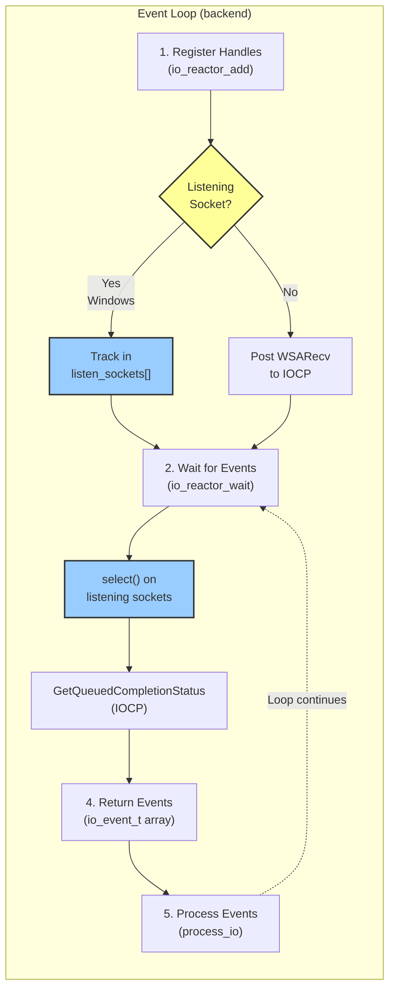

# I/O Reactor Design for Neolith Backend Loop

## Overview

This document provides comprehensive documentation for the I/O reactor design for cross-platform non-blocking I/O in Neolith. The I/O reactor is a platform-agnostic abstraction layer that provides a unified interface for non-blocking I/O multiplexing across different operating systems. It implements the **Reactor Pattern**, decoupling the event detection mechanism from event handling logic.

### Related Documents

For platform-specific implementation details, see:

1. **[Linux I/O Implementation](linux-io.md)**
   - Current `poll()` implementation
   - Migration from existing code
   - Console input handling on Linux
   - Future `epoll()` enhancement
   - Performance characteristics

2. **[Windows I/O Implementation](windows-io.md)**
   - Windows Winsock limitations
   - I/O Completion Ports (IOCP) solution
   - IOCP context structures and lifecycle
   - Console input handling on Windows
   - Performance characteristics

### Current Implementation Status

✅ **Phase 1: Core Abstraction** ([Report](../history/agent-reports/io-reactor-phase1.md))
- [x] Platform-agnostic API defined in [lib/port/io_reactor.h](../../lib/port/io_reactor.h)
- [x] POSIX `poll()` implementation in [lib/port/io_reactor_poll.c](../../lib/port/io_reactor_poll.c)
- [x] Comprehensive unit tests (19 test cases, all passing)
- [x] Build system integration

✅ **Phase 2: Windows IOCP** ([Report](../history/agent-reports/io-reactor-phase2.md))
- [x] Windows IOCP implementation in [lib/port/io_reactor_win32.c](../../lib/port/io_reactor_win32.c)
- [x] IOCP-specific unit tests (4 test cases)
- [x] Listening socket support (6 test cases)
- [x] Hybrid approach: select() for listening sockets, IOCP for data I/O
- [x] Cross-platform test suite (29 total tests, all passing)
- [x] Build system integration for Windows

⬜ **Phase 3: Backend Integration**
- [ ] Replace `poll()`/`select()` in [src/comm.c](../../src/comm.c)
- [ ] Reactor-based event loop
- [ ] Migration of existing connections
- [ ] Console support for Windows

⬜ **Phase 4: Future Enhancements**
- [ ] Linux `epoll()` backend
- [ ] BSD/macOS `kqueue()` support
- [ ] Performance benchmarking

## Reactor Pattern Fundamentals

The reactor pattern is a design pattern for handling service requests delivered concurrently to an application by demultiplexing events and dispatching them to appropriate handlers.

### Key Components

1. **Handles**: File descriptors, sockets, or other I/O sources
2. **Event Demultiplexer**: Platform-specific mechanism (poll, epoll, IOCP, kqueue)
3. **Event Handlers**: Callbacks that process specific event types
4. **Reactor**: Orchestrates event detection and handler dispatch

### Flow



**Note**: On Windows, listening sockets use `select()` (readiness-based) while connected sockets use IOCP (completion-based). POSIX platforms use a single demultiplexer (`poll()` or `epoll()`) for all socket types.

**Event Loop:**
1. Application registers handles with the reactor
2. Reactor waits for events on registered handles (blocking with timeout)
3. Event demultiplexer returns when events occur
4. Reactor dispatches events to registered handlers
5. Handlers process events
6. Loop repeats

## Design Goals

1. **Platform Portability**: Single codebase for Linux, Windows, BSD, etc.
2. **Code Clarity**: Minimize `#ifdef` pollution in business logic
3. **Scalability**: Efficient handling of hundreds/thousands of connections
4. **Performance**: Low-latency I/O for interactive MUD experience
5. **Maintainability**: Clear separation between platform and application concerns
6. **Console Support**: Unified handling of network sockets and console I/O

## I/O Reactor Abstraction API

The reactor API is defined in [lib/port/io_reactor.h](../../lib/port/io_reactor.h). Key components:

### Event Types
- `EVENT_READ` - Socket/fd is readable
- `EVENT_WRITE` - Socket/fd is writable  
- `EVENT_ERROR` - Error occurred
- `EVENT_CLOSE` - Connection closed

### Core Structures
- `io_event_t` - Event returned by reactor (context, type, optional buffer)
- `io_reactor_t` - Opaque reactor handle

### Functions
- **Lifecycle**: `io_reactor_create()`, `io_reactor_destroy()`
- **Registration**: `io_reactor_add()`, `io_reactor_modify()`, `io_reactor_remove()`
- **Event Loop**: `io_reactor_wait()` - core demultiplexing function
- **Platform Helpers**: `io_reactor_post_read()`, `io_reactor_post_write()` (no-ops on POSIX)

See the header file for complete API documentation with detailed parameter descriptions.

## Integration with Neolith Backend

### Initialization

In [src/comm.c](../../src/comm.c), replace direct `poll()`/`select()` usage:

```c
#include "port/io_reactor.h"

static io_reactor_t *g_io_reactor = NULL;

void init_user_conn(void) {
    /* ... existing socket setup ... */
    
    g_io_reactor = io_reactor_create();
    if (!g_io_reactor) {
        debug_fatal("Failed to create I/O reactor\n");
        exit(EXIT_FAILURE);
    }
    
    /* Add console if in console mode */
    if (MAIN_OPTION(console_mode)) {
        /* Platform-specific console registration */
        io_reactor_add_console(g_io_reactor);
    }
}

void ipc_remove(void) {
    /* ... existing cleanup ... */
    
    if (g_io_reactor) {
        io_reactor_destroy(g_io_reactor);
        g_io_reactor = NULL;
    }
}
```

### Event Loop

Replace `do_comm_polling()` to use reactor:

```c
int do_comm_polling(struct timeval *timeout) {
    static io_event_t events[MAX_EVENTS];
    
    opt_trace(TT_BACKEND|3, "do_comm_polling: timeout %ld sec, %ld usec",
              timeout->tv_sec, timeout->tv_usec);
    
    return io_reactor_wait(g_io_reactor, events, MAX_EVENTS, timeout);
}
```

### Handle Registration

Register new interactive users:

```c
void new_interactive(socket_fd_t socket_fd) {
    /* ... existing code to allocate all_users[i] ... */
    
    /* Register with I/O reactor */
    if (io_reactor_add(g_io_reactor, socket_fd, all_users[i], EVENT_READ) != 0) {
        debug_message("Failed to register socket %d with I/O reactor\n", socket_fd);
        /* Handle error */
    }
}
```

Unregister on disconnect:

```c
void remove_interactive(object_t *ob, int dested) {
    if (ob->interactive) {
        io_reactor_remove(g_io_reactor, ob->interactive->fd);
    }
    
    /* ... existing cleanup ... */
}
```

### Event Processing

Modify `process_io()` to handle reactor events:

```c
void process_io(void) {
    static io_event_t events[MAX_EVENTS];
    int num_events = /* saved from last do_comm_polling() call */;
    
    for (int i = 0; i < num_events; i++) {
        io_event_t *evt = &events[i];
        
        switch (evt->event_type) {
            case EVENT_READ: {
                /* Handle read event */
                interactive_t *ip = (interactive_t*)evt->context;
                
                /* On completion-based platforms, data is in evt->buffer */
                /* On readiness-based platforms, call get_user_data() */
                if (evt->buffer && evt->bytes_transferred > 0) {
                    /* Process pre-read data (IOCP) */
                    process_input_buffer(ip, evt->buffer, evt->bytes_transferred);
                    /* Repost async read */
                    io_reactor_post_read(g_io_reactor, ip->fd, NULL, 0);
                } else {
                    /* Readiness notification (poll) */
                    get_user_data(ip);
                }
                break;
            }
            
            case EVENT_WRITE: {
                /* Handle write completion */
                interactive_t *ip = (interactive_t*)evt->context;
                flush_message(ip);
                break;
            }
            
            case EVENT_CLOSE: {
                /* Handle disconnection */
                interactive_t *ip = (interactive_t*)evt->context;
                remove_interactive(ip->ob, 0);
                break;
            }
            
            case EVENT_ERROR: {
                /* Handle I/O error */
                interactive_t *ip = (interactive_t*)evt->context;
                ip->iflags |= NET_DEAD;
                break;
            }
        }
    }
}
```

## Platform Implementation Requirements

Each platform must implement the reactor interface defined above. See platform-specific documents:

- [Linux I/O Reactor Design](linux-io.md) - Using `poll()` or `epoll()`
- [Windows I/O Reactor Design](windows-io.md) - Using I/O Completion Ports (IOCP)

### Windows Listening Socket Handling

**Challenge**: Windows IOCP is completion-based (notifies when I/O operations complete), but listening sockets don't perform I/O—they only become "ready" to accept connections.

**Solution**: Hybrid approach implemented in [io_reactor_win32.c](../../lib/port/io_reactor_win32.c):

1. **Detection**: Use `getsockopt(SO_ACCEPTCONN)` to identify listening sockets during `io_reactor_add()`
2. **Tracking**: Store listening sockets in a separate `listen_sockets[]` array (dynamically resized)
3. **Polling**: In `io_reactor_wait()`, call `select()` with zero timeout on listening sockets before blocking on IOCP
4. **Event Delivery**: Return `EVENT_READ` when listening socket is ready to accept

**Rationale**: This allows the reactor to provide a unified API while leveraging the optimal mechanism for each socket type:
- Listening sockets → `select()` (readiness notification)
- Connected sockets → IOCP (completion notification with zero-copy data delivery)

See [Windows I/O Implementation](windows-io.md) for complete details.

### Implementation Files

```
lib/port/
├── io_reactor.h           # Platform-agnostic API (this document)
├── io_reactor_poll.c      # POSIX poll() implementation
├── io_reactor_epoll.c     # Linux epoll() implementation (future)
├── io_reactor_kqueue.c    # BSD/macOS kqueue() implementation (future)
└── io_reactor_win32.c     # Windows IOCP implementation
```

### CMake Integration

✅ **Current Implementation** ([lib/port/CMakeLists.txt](../../lib/port/CMakeLists.txt)):

```cmake
# lib/port/CMakeLists.txt
set(port_SOURCES
    # ... other sources ...
    # I/O Reactor - platform-specific implementation selection
    $<$<NOT:$<PLATFORM_ID:Windows>>:io_reactor_poll.c>
)

target_sources(port INTERFACE
    FILE_SET HEADERS
    BASE_DIRS ..
    FILES ... io_reactor.h socket_comm.h
)
```

**Future Platform Selection**:
```cmake
# Phase 2: Add Windows support
if(WIN32)
    target_sources(port PRIVATE io_reactor_win32.c)
else()
    target_sources(port PRIVATE io_reactor_poll.c)
endif()

# Phase 4: Optimize with epoll on Linux
elseif(CMAKE_SYSTEM_NAME STREQUAL "Linux" AND HAVE_EPOLL)
    target_sources(port PRIVATE io_reactor_epoll.c)
```

## Testing Strategy

### Unit Tests: `tests/test_io_reactor/`

✅ **Phase 1 & 2 Complete** - Comprehensive GoogleTest suite implemented:

**Test Coverage** (29 test cases, all passing):
- **Lifecycle** (3 tests): CreateDestroy, CreateMultiple, DestroyNull
- **Registration** (6 tests): AddRemoveSocket, AddWithContext, AddDuplicateFails, RemoveNonExistent, ModifyEvents, ModifyNonExistentFails
- **Event Wait** (5 tests): TimeoutNoEvents, EventDelivery, MultipleEvents, MaxEventsLimitation, WriteEvent
- **Error Handling** (2 tests): InvalidParameters, AddInvalidFd
- **Scalability** (1 test): ManyConnections (100 socket pairs)
- **Platform Helpers** (2 tests): PostReadNoOp, PostWriteNoOp
- **Listening Sockets** (6 tests): BasicListenAccept, MultipleListeningPorts, MultipleSimultaneousConnections, ContextPointerRangeCheck, ListenWithUserSockets, NoEventsWhenNoConnections
- **IOCP-Specific** (4 tests): CompletionWithDataInBuffer, GracefulClose, CancelledOperations, MultipleReadsOnSameSocket

**Running Tests**:
```bash
# Run reactor tests only (Linux)
ctest --preset ut-linux --tests-regex IOReactor --output-on-failure

# Run reactor tests only (Windows)
ctest --preset ut-vs16-x64 --tests-regex IOReactor --output-on-failure

# Run all tests
ctest --preset ut-linux   # or ut-vs16-x64 on Windows
```

**Results**: 
- Linux: `100% tests passed, 0 tests failed out of 19` (0.12s runtime)
- Windows: `100% tests passed, 0 tests failed out of 29` (1.69s runtime)

See complete test implementations:
- [tests/test_io_reactor/test_io_reactor_basic.cpp](../../tests/test_io_reactor/test_io_reactor_basic.cpp)
- [tests/test_io_reactor/test_io_reactor_listen.cpp](../../tests/test_io_reactor/test_io_reactor_listen.cpp)
- [tests/test_io_reactor/test_io_reactor_iocp.cpp](../../tests/test_io_reactor/test_io_reactor_iocp.cpp)

### Integration Tests

⬜ **Phase 3: Backend Integration** - Planned stress testing with actual mudlib:

1. **Multi-player Load**: 100+ concurrent connections
2. **Console Mode**: Verify STDIN handling works  
3. **Message Throughput**: Large messages, rapid sends
4. **Connection Churn**: Rapid connect/disconnect cycles

### Platform Coverage

✅ **Current**: Linux/POSIX (poll-based implementation)
- Tested on Linux (Ubuntu) via WSL
- GoogleTest framework integration
- Unit test coverage for all API functions

⬜ **Planned**:
- [ ] CI testing on native Linux (Ubuntu)
- [ ] Windows (Server 2022) with IOCP implementation
- [ ] macOS with poll() or kqueue()
- [ ] Both 32-bit and 64-bit builds
- [ ] Integration tests with example mudlib

## Error Handling

### Reactor Creation Failure
- **Cause**: System resource exhaustion, invalid parameters
- **Response**: Fatal error during `init_user_conn()`, exit driver

### Handle Registration Failure
- **Cause**: Invalid file descriptor, reactor full, platform limits
- **Response**: Log warning, reject connection gracefully

### Event Wait Failure
- **Cause**: System call interrupted, invalid timeout
- **Response**: Log error, retry with exponential backoff

### Event Processing Errors
- **Cause**: Closed handles, invalid context pointers
- **Response**: Mark connection as `NET_DEAD`, cleanup safely

## Memory Management

### Reactor State
- Allocate once during `init_user_conn()`
- Destroy during `ipc_remove()` or shutdown
- No per-event allocations in hot path

### Event Arrays
- Stack-allocated or static in `do_comm_polling()`/`process_io()`
- Reused across event loop iterations
- Configurable maximum size

### Context Pointers
- Application-managed (reactor only stores/returns them)
- Typically point to `interactive_t`, `port_def_t`, or `lpc_socket_t`
- Must remain valid while handle is registered

## Performance Considerations

### Batching
- Process multiple events per cycle (up to `io_reactor_max_events`)
- Amortize system call overhead

### Zero-Copy
- On platforms supporting it (IOCP), data delivered in event structure
- Avoid redundant buffer copies

### Scalability
- Event loop should be O(1) or O(log n) per event, not O(n)
- Platform implementations must use efficient demultiplexing

## Implementation Phases

### Phase Reports
- ✅ [Phase 1: Core Abstraction](../history/agent-reports/io-reactor-phase1.md) - COMPLETE
- ⬜ Phase 2: Windows IOCP - Not started
- ⬜ Phase 3: Backend Integration - Not started
- ⬜ Phase 4: Future Enhancements - Optional

See detailed phase breakdowns in the respective implementation documents:
- [Linux Implementation](linux-io.md#migration-from-current-code)
- [Windows Implementation](windows-io.md)

## Quick Start

For developers wanting to understand or implement the reactor:

1. Read this document for the platform-agnostic design and abstraction API
2. Read your platform's specific implementation:
   - Linux: [linux-io.md](linux-io.md)
   - Windows: [windows-io.md](windows-io.md)
3. Review test cases in `tests/test_io_reactor/`
4. Check integration points in [src/comm.c](../../src/comm.c)

## Implementation Files

```
lib/port/
├── io_reactor.h           # Platform-agnostic API (this document)
├── io_reactor_poll.c      # POSIX poll() implementation
├── io_reactor_epoll.c     # Linux epoll() implementation (future)
├── io_reactor_kqueue.c    # BSD/macOS kqueue() implementation (future)
└── io_reactor_win32.c     # Windows IOCP implementation
```

## Documentation

### Implementation Reports
- [Phase 1 Report](../history/agent-reports/io-reactor-phase1.md) - Core abstraction complete

### Remaining Documentation Tasks
- [ ] Update [docs/manual/internals.md](internals.md) with reactor architecture
- [ ] Document platform-specific behaviors in [docs/INSTALL.md](../INSTALL.md)
- [ ] Add troubleshooting guide for I/O issues
- [ ] Update [docs/manual/dev.md](dev.md) with portability patterns

## References

- [Reactor Pattern (Douglas Schmidt)](https://www.dre.vanderbilt.edu/~schmidt/PDF/reactor-siemens.pdf)
- [POSA2: Patterns for Concurrent and Networked Objects](https://www.amazon.com/Pattern-Oriented-Software-Architecture-Concurrent-Networked/dp/0471606952)
- Platform-specific references in [linux-io.md](linux-io.md) and [windows-io.md](windows-io.md)

---

**Status**: Draft Design  
**Author**: GitHub Copilot  
**Date**: 2025-12-30  
**Target Version**: Neolith v1.0
